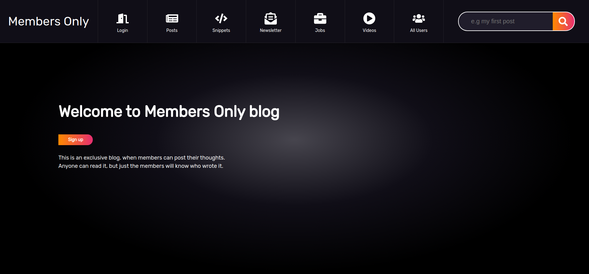

# Members Only

In this app we created a blog where users can post comments, but only members can see the authors. It has the following functionalities:

- Sign up new members;
- Authenticate members;
- Remember logged in users;
- Create new posts.

## Preview

## Built with

- HTML 5 (erb);
- CSS 3 (scss);
- Ruby 2.6.3;
- Rails 6.0.1.

## Authors

:woman: **Bruna Genz**

- Github: [@bruna-genz](https://github.com/bruna-genz)

:man: **Nicolás Mariño**

- Github: [@nicolasmarino99](https://github.com/nicolasmarino99)